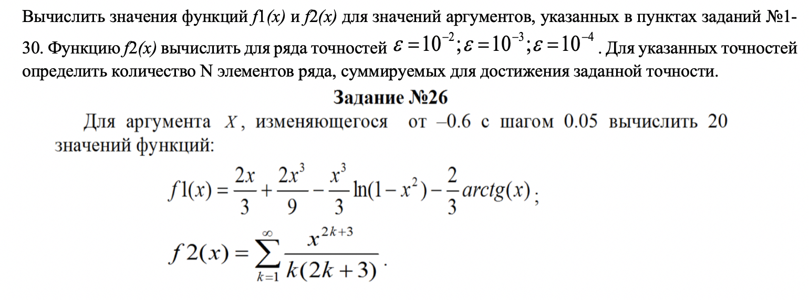

# **Задание 26**

​

> Delphi
```Delphi
program laba1;
uses
  Math,
  System.SysUtils;

var
  x, y, a, b, h: real;

function root(x: real): real;
begin
  if x < 0 then
    result := -exp(ln(-x) / 5)
  else
  begin
    if x > 0 then
      result := exp(ln(x) / 5)
    else
      result := 0;
  end;
end;

procedure output(x: real);
begin
  if abs(x - 1) < 1 / 10000 then
    x := 1;
  if abs(cos(x) + 1) < 1 / 10000 then
    x := pi;
  if (x - 1 <> 0) and (cos(x) + 1 > 0) then
  begin
    y := exp(2.5 * x / (x - 1)) - (root(x) + sin(pi * x / 3)) /
     (exp(x) * sqrt(cos(x) + 1);
    writeln('x= ', x: 5: 2, ' y=', y: 5: 2)
  end
    else
     writeln('fox x= ', x: 5: 2, ' y is not defined');
end;

begin
    writeln('Enter the initial value of x'); readln(a);
    writeln('Enter the final value of x'); readln(b);
    writeln('Enter a step value'); readln(h);
    x := a;
    if ((a < b) and (h <= 0)) or ((a > b) and (h >= 0))
    then
    begin
      output(x);
      output(b);
      end
      else
      if h > 0 then
      begin
       while x < b - h / 10 do
       begin
       output(x);
       x := x + h;
      end;
       output(b);
    end
      else
      begin
        while x > b - h / 10 do
         begin
         output(x);
         x := x + h;
         end;
        output(b);
      end; 
readln;
end.
```
